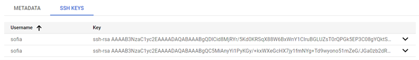
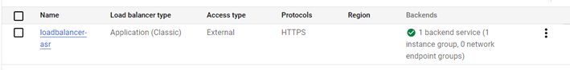

# PRÁCTICA 2: VIRTUAL MACHINES
## Arquitectura de Servicios de Red
### Sofía Barquero Jiménez- 1ºA MIT, 201805688
En esta práctica, se crearán máquinas virtuales con las siguientes reglas de seguridad: 
  *	Regla del mínimo privilegio.
  *	Exponer únicamente lo mínimo imprescindible a internet.
  *	Usar siempre tráfico cifrado (siempre en internet)
  *	Usar siempre un doble salto para un acceso a un servidor si este está expuesto a internet

#### 1ª Solución: creación de máquina de salto
*	Exponer únicamente en el servidor web lo mínimo indispensable
*	Montar una máquina de salto para poder acceder a nuestra máquina. Esta máquina se debería encender y apagar cada vez que se quiera modificar algo del servidor web.

En primer lugar, para exponer únicamente en el servidor web lo mínimo indispensable, borramos las reglas de firewall que vienen predeterminadas y habrá que crear tres nuevas reglas:  
*	Que a la máquina original solo se pueda acceder a través de internet: para ello se crea una regla para poder acceder desde el puerto 80. Esta es la regla que me quedo de la captura anterior.
*	Que solo se pueda acceder desde el puerto 22 a través de mi IP: para la máquina de salto a la que sí se puede acceder desde fuera.
*	El primer requerimiento para que se hablen entre si es que estén en la misma red así que habría que crear una subnet

Una vez se tengan establecidas las reglas del firewall, se deberán generar las claves pública y privada en el ordenador con el comando 'ssh-keygen' y a continuación guardar la clave pública:

Esto nos permitirá por fin entrar en la máquina de salto desde ssh.

Desde dentro de la máquina de salto se repetirá el proceso: creamos nuevas claves y guardamos la pública.

Así completaríamos la primera parte de la práctica accediendo a nuestra máquina virtual del servidor:

#### 2ª mejora solución: introducción a los WAF - Web Application Firewall (firewall capa 7)

Para esta parte de la práctica, se creará otra nueva máquina virtual del servidor web, esta vez sin IP pública.

Como no tiene ip publica no tiene salida a internet. Si necesitase algo, en lugar de irse a internet iría a través de máquinas específicas. En lugar de crearnos maquinas especificas tenemos que habilitar un servicio que se llama cloudnat que es muy parecido al internet de casa y lo que hace es hacer de Gateway y mete en las tablas de ruta que si se quiere acceder a internet sea a través de cloudnat. Esto se necesitará para instalas paquetería en esta máquina.

Para que nuestro servidor pueda hablar de forma segura en la red, deberemos crear nuestro propio crertificado para poder conectarnos a través de https. A esto se le llama **https-offloading**, así la petición entraría por el puerto 443, el balanceador la abre y la transforma de https a http. 
Para crear nuestro propio certificado habrá que seguir los siguientes pasos:
1.	Openssl con un config. Vamos a crear un certificado para el dominio asr.icai.es (es un ejemplo). Nos va a crear un .key (clave privada) y un csr que es una petición de firmado de certificado. Este csr es lo que necesitamos que alguien nos firme para que certifique que somos nosotros.
2.	Para firmar el certificado: necesitamos el csr y al firmado nos va a generar el .pem que estará firmado por una CA. En realidad, nos lo vamos a firmar nosotros mismos por lo que la CA estará inventada por nosotros.
3.	Una vez que tenemos el .key y el .pem es lo que cargaremos en nuestro servidor (balanceador).
4.	Para la renovación automática de certificados, va por DNS o por HTTP. Si va por DNS, se le pide que se carguen unos registros especiales para saber quien es.

Con el certificado creado, empezaríamos a configurar el Load Balancer

Antes de configurar el servicio Backend, se deberá configurar un grupo de instancias:

Ahora si, el backend:

la configuración final del load Balancer quedaría:

Para la correcta comunicación entre el balanceador y el servidor, habrá que crear una nueva regla de firewall:

A continuación, creamos el cloud armor y establecemos algunas normas de seguridad para proteger nuestra máquina de ataques SQL Injection, Cross Site Scripting y restringir el tráfico sólo a España, implantando un WAF a nuestro balanceador.

Así, ya podemos acceder a internet a traves de nuestro balanceador:

Nótese que indica que la pagina no es segura porque el certificado que hemos creado es nuestro.

#### 3ª Solución: Zero trust
Para la parte final, nos pide cifrar el contenido web también dentro del cloud y quitar el HTTPS offloading.

Para ello, habrá que introducir el certificado y la clave privada de este en la máquina del servidor web. Primero, habria que pasarlo de nuestro sistema a la máquina de salto y de ahi a la máquina del servidor. 

Por último, habría que configurar el archivo **default** de la ruta **/etc/nginx** e indicar que escuche desde el puerto 443 y que incluya un archivo de configuración en el que se le especifica dónde están el certificado y la clave almacenados en el servidor:

